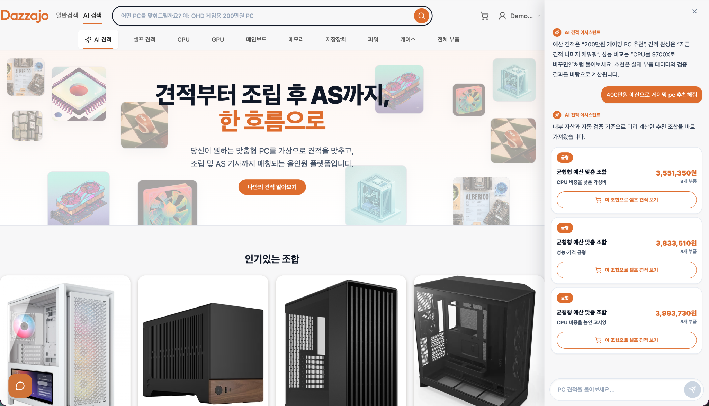
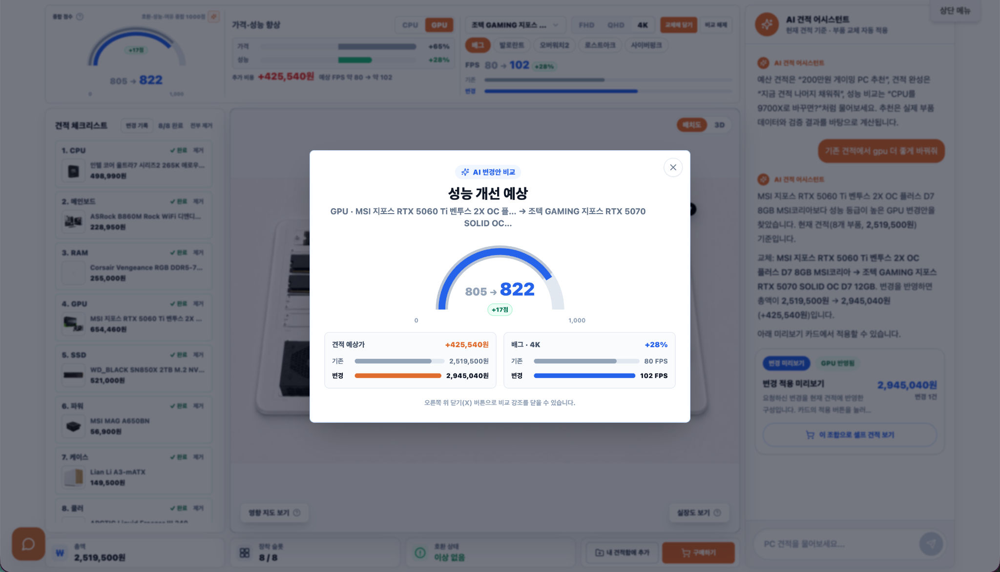
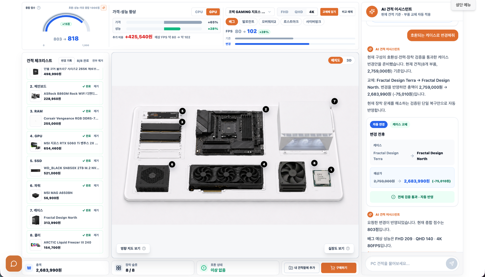
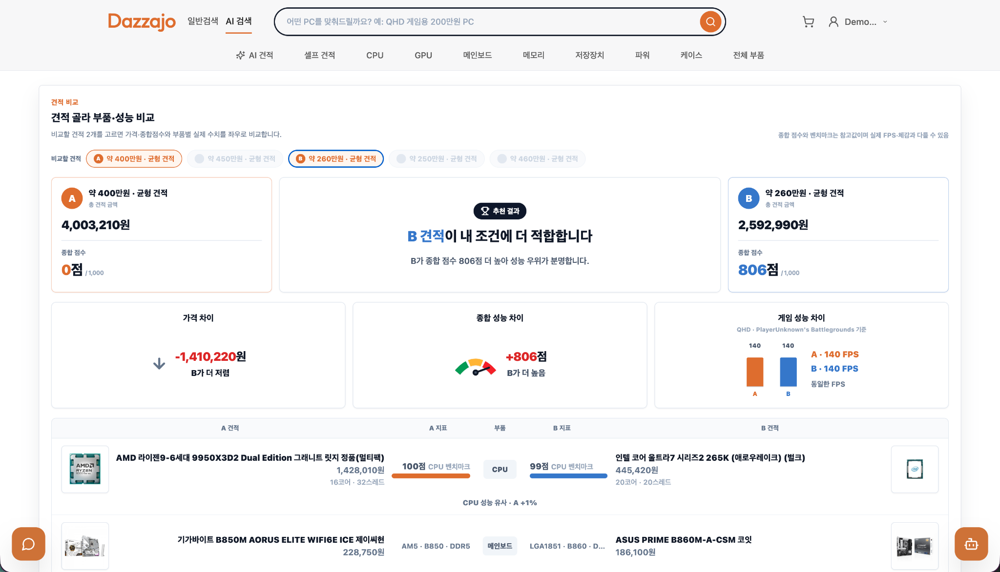
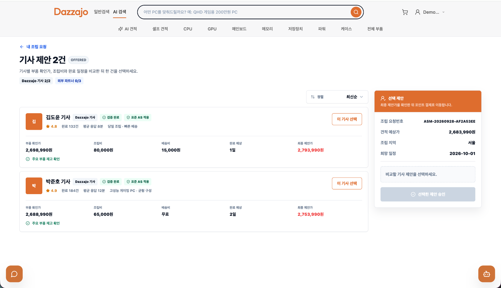
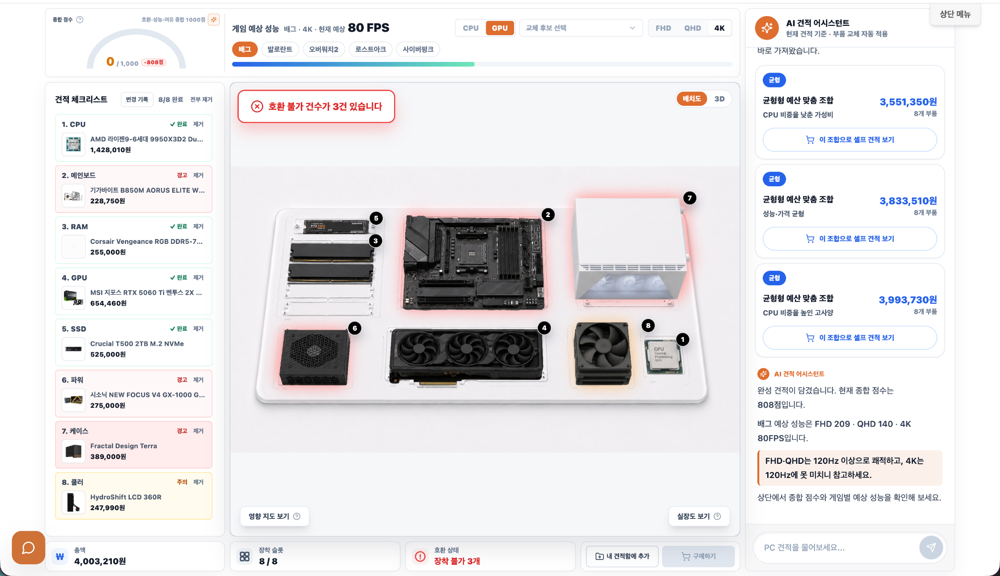
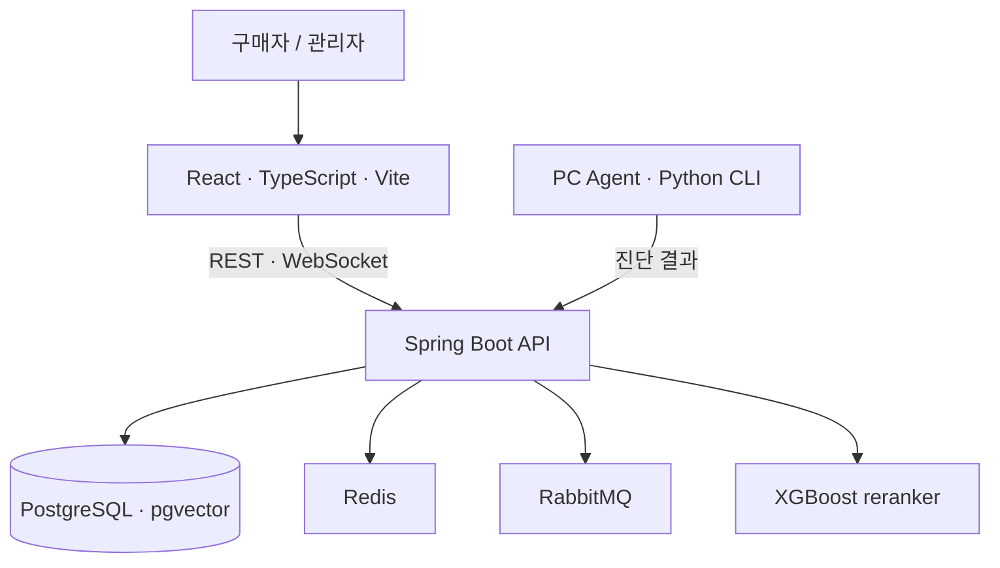

# DazzaJo · BuildGraph AI

**예산과 사용 목적에 맞는 조립 PC를 추천하고, 부품 호환성 확인부터 견적 변경과 사후 상담까지 이어 주는 서비스**입니다.

[](https://github.com/hos0ek71/dazzajo-portfolio) [](https://github.com/jungle-final-project/prototype)

> 5인 팀 프로젝트를 개인 포트폴리오 목적으로 Fork한 저장소입니다. 아래 개인 기여는 제가 작성한 실제 PR을 기준으로 정리했습니다.

## 서비스 소개

사용자가 예산과 게임·작업 목적을 입력하면 AI가 PC 부품 조합을 제안합니다. 사용자는 견적을 직접 조정하고, 부품 관계 그래프와 호환 상태를 확인하며, 필요한 경우 AS 티켓과 상담 채팅으로 이어 갈 수 있습니다.

## 대표 화면

<table>
  <tbody>
    <tr>
      <td><br>AI가 사용 목적과 예산에 맞는 조립 PC 견적을 추천합니다.</td>
      <td><br>GPU 변경에 따른 예상 FPS와 견적 가격 차이를 비교합니다.</td>
    </tr>
    <tr>
      <td><br>호환 경고가 난 케이스를 대체 부품으로 바꾸고 다시 검증합니다.</td>
      <td><br>여러 견적의 가격과 핵심 부품 구성을 비교합니다.</td>
    </tr>
    <tr>
      <td colspan="2"><br>기사별 조립 제안과 가격을 비교해 서비스를 선택합니다.</td>
    </tr>
  </tbody>
</table>

## UI 화면 흐름

<table>
  <tbody>
    <tr>
      <td></td>
      <td></td>
    </tr>
    <tr>
      <td></td>
      <td></td>
    </tr>
    <tr>
      <td></td>
      <td></td>
    </tr>
    <tr>
      <td>&nbsp;&nbsp;&nbsp;&nbsp;&nbsp;&nbsp;&nbsp;&nbsp;&nbsp;&nbsp;&nbsp;&nbsp;&nbsp;&nbsp;&nbsp;&nbsp;&nbsp;&nbsp;&nbsp;&nbsp;&nbsp;&nbsp;&nbsp;&nbsp;&nbsp;&nbsp;&nbsp;&nbsp;&nbsp;&nbsp;&nbsp;&nbsp;&nbsp;&nbsp;&nbsp;&nbsp;&nbsp;&nbsp;&nbsp;&nbsp;&nbsp;&nbsp;&nbsp;&nbsp;&nbsp;&nbsp;&nbsp;&nbsp;&nbsp;&nbsp;&nbsp;&nbsp;&nbsp;&nbsp;&nbsp;&nbsp;&nbsp;&nbsp;&nbsp;&nbsp;&nbsp;&nbsp;&nbsp;&nbsp;&nbsp;&nbsp;&nbsp;&nbsp;&nbsp;&nbsp;&nbsp;&nbsp;&nbsp;&nbsp;&nbsp;&nbsp;&nbsp;&nbsp;&nbsp;&nbsp;&nbsp;&nbsp;&nbsp;&nbsp;&nbsp;&nbsp;&nbsp;&nbsp;&nbsp;&nbsp;&nbsp;&nbsp;&nbsp;&nbsp;&nbsp;&nbsp;&nbsp;&nbsp;&nbsp;&nbsp;<br><br><br><br><br><br><br><br><br></td>
      <td>&nbsp;&nbsp;&nbsp;&nbsp;&nbsp;&nbsp;&nbsp;&nbsp;&nbsp;&nbsp;&nbsp;&nbsp;&nbsp;&nbsp;&nbsp;&nbsp;&nbsp;&nbsp;&nbsp;&nbsp;&nbsp;&nbsp;&nbsp;&nbsp;&nbsp;&nbsp;&nbsp;&nbsp;&nbsp;&nbsp;&nbsp;&nbsp;&nbsp;&nbsp;&nbsp;&nbsp;&nbsp;&nbsp;&nbsp;&nbsp;&nbsp;&nbsp;&nbsp;&nbsp;&nbsp;&nbsp;&nbsp;&nbsp;&nbsp;&nbsp;&nbsp;&nbsp;&nbsp;&nbsp;&nbsp;&nbsp;&nbsp;&nbsp;&nbsp;&nbsp;&nbsp;&nbsp;&nbsp;&nbsp;&nbsp;&nbsp;&nbsp;&nbsp;&nbsp;&nbsp;&nbsp;&nbsp;&nbsp;&nbsp;&nbsp;&nbsp;&nbsp;&nbsp;&nbsp;&nbsp;&nbsp;&nbsp;&nbsp;&nbsp;&nbsp;&nbsp;&nbsp;&nbsp;&nbsp;&nbsp;&nbsp;&nbsp;&nbsp;&nbsp;&nbsp;&nbsp;&nbsp;&nbsp;&nbsp;&nbsp;<br><br><br><br><br><br><br><br><br></td>
    </tr>
  </tbody>
</table>

## 시스템 아키텍처



Green 환경의 독립 배포 경로는 [아키텍처 문서](docs/portfolio/architecture.md)에 별도 다이어그램으로 정리했습니다. 해당 그림은 저장소 PR에서 구성한 배포 경로를 나타내며, 현재 운영 트래픽 상태를 의미하지는 않습니다.

## 기술 스택

| 영역 | 기술 | 사용 범위 |
| --- | --- | --- |
| Web | React, TypeScript, Vite, Tailwind CSS, TanStack Query | 사용자·관리자 화면, 견적 및 상담 흐름 |
| API | Java 21, Spring Boot | 견적·부품·상담 API, REST 및 WebSocket |
| 데이터 | PostgreSQL, pgvector, Redis, RabbitMQ | 서비스 데이터, 벡터 검색, 캐시, 메시지 전달 |
| 추천 | Python, XGBoost | 추천 후보 점수화 및 reranking |
| 로컬 환경 | Docker Compose | Web, API, DB 등 개발 서비스 실행 |
| 배포 | GitHub Actions, AWS S3/CloudFront, ECR, EC2/ASG, SSM | Web·API 이미지 배포 및 Green 릴리스 경로 |

## My Contribution

개인 기여는 저장소 전체가 아니라 아래 PR에 포함된 작업입니다. 특히 제품 화면 작업 중 제 담당은 **부품 관계 그래프 UI**였으며, 견적서의 slotboard UI는 제 기여로 포함하지 않았습니다.

- **부품 관계 그래프와 호환 대체 제안** — 그래프에서 부품 관계와 호환 후보를 확인하고, 현재 조합의 검증 상태를 표시하는 흐름을 구현했습니다. [PR #37](https://github.com/jungle-final-project/prototype/pull/37), [PR #48](https://github.com/jungle-final-project/prototype/pull/48)
- **AS 티켓 상담 채팅** — 고객·관리자 상담방과 실시간 메시지 전달 흐름을 구현하고, 관리자 티켓 상세에서 재접속과 폴링 대체 경로를 보강했습니다. [PR #76](https://github.com/jungle-final-project/prototype/pull/76), [PR #86](https://github.com/jungle-final-project/prototype/pull/86), [PR #259](https://github.com/jungle-final-project/prototype/pull/259)
- **AWS 배포 자동화** — Green 환경 배포, 이미지 다이제스트 기반 릴리스, 인스턴스 업데이트·상태 확인·롤백 경로를 구성했습니다. [PR #171](https://github.com/jungle-final-project/prototype/pull/171), [PR #214](https://github.com/jungle-final-project/prototype/pull/214), [PR #222](https://github.com/jungle-final-project/prototype/pull/222)

## 기술적 문제 해결

### 1. 견적 변경 결과를 관계 그래프에서 판단할 수 있게 구성

부품을 바꿀 때 사용자가 후보와 기존 부품 간의 관계 및 호환 상태를 함께 확인하도록 그래프와 대체 후보 흐름을 연결했습니다. 그래프 결과에는 PASS·WARN·FAIL 상태를 반영해 조합 검증 결과를 드러냈습니다. ([PR #37](https://github.com/jungle-final-project/prototype/pull/37), [PR #48](https://github.com/jungle-final-project/prototype/pull/48))

### 2. WebSocket 연결에 URL 토큰을 싣지 않고 상담방 인증

상담 메시지는 REST로 보내고 WebSocket은 실시간 수신에 사용하도록 역할을 나눴습니다. 연결 시 JWT를 URL에 넣는 대신 REST로 발급한 1회용 티켓을 첫 인증 프레임으로 전달했습니다. ([PR #76](https://github.com/jungle-final-project/prototype/pull/76))

### 3. 실시간 연결이 끊겨도 상담 상태를 복구

관리자 상담 목록은 WebSocket 알림을 사용하고 REST polling 대체 경로를 두었습니다. 티켓 상세 채팅은 재접속 간격을 늘려 재시도하고, 연결이 복구되지 않을 때 5초 간격 polling으로 메시지를 확인하도록 보강했습니다. 관련 Playwright 및 백엔드 테스트를 PR에 포함했습니다. ([PR #86](https://github.com/jungle-final-project/prototype/pull/86), [PR #259](https://github.com/jungle-final-project/prototype/pull/259))

### 4. Green 배포에서 이미지와 복구 경로를 명시

배포 대상이 빌드 시점과 달라지는 문제를 줄이도록 ECR 이미지 다이제스트를 배포 경로에서 사용하고, 인스턴스 상태 확인과 실패 시 롤백 단계를 구성했습니다. ASG 전체 갱신이 필요 없는 경우 기존 정상 인스턴스에 컨테이너를 빠르게 교체하는 경로도 추가했습니다. ([PR #171](https://github.com/jungle-final-project/prototype/pull/171), [PR #222](https://github.com/jungle-final-project/prototype/pull/222))

## 대표 PR

| PR | 내용 |
| --- | --- |
| [#37](https://github.com/jungle-final-project/prototype/pull/37) | 견적 관계 그래프와 호환 부품 추천 |
| [#48](https://github.com/jungle-final-project/prototype/pull/48) | 그래프 미리보기·검증 상태와 견적 관계도 관리 |
| [#76](https://github.com/jungle-final-project/prototype/pull/76) | 사용자·관리자 AS 상담방, WebSocket 인증 티켓 |
| [#86](https://github.com/jungle-final-project/prototype/pull/86) | 관리자 실시간 상담 목록, 예약 및 복구 흐름 |
| [#259](https://github.com/jungle-final-project/prototype/pull/259) | 관리자 티켓 상세 채팅과 재연결·폴링 테스트 |
| [#171](https://github.com/jungle-final-project/prototype/pull/171) | Green 환경 분리 배포 및 이미지 SHA 롤백 경로 |
| [#214](https://github.com/jungle-final-project/prototype/pull/214) | Green Web ASG 사설망 전환과 릴리스 경로 |
| [#222](https://github.com/jungle-final-project/prototype/pull/222) | 기존 정상 인스턴스 빠른 배포 및 롤백 |

## 로컬 실행

Docker가 설치된 환경에서 아래 명령으로 개발 서비스를 실행할 수 있습니다.

```bash
git clone https://github.com/hos0ek71/dazzajo-portfolio.git
cd dazzajo-portfolio
cp .env.example .env
docker compose up --build
```

기본 설정은 로컬 UI와 기본 견적 흐름 확인에 사용할 수 있습니다. 외부 LLM의 실제 응답을 확인하려면 `.env`에 `OPENAI_API_KEY`를 설정해야 합니다. 비밀값은 커밋하지 마세요.

원본 팀 개발 문서와 계약은 그대로 보존했습니다.

- [원본 README](docs/ORIGINAL_README.md)
- [API 계약](docs/API_CONTRACT.md)
- [DB 스키마](docs/DB_SCHEMA.md)
- [배포 아키텍처](docs/portfolio/architecture.md)

## 저장소

- 개인 포트폴리오 Fork: [hos0ek71/dazzajo-portfolio](https://github.com/hos0ek71/dazzajo-portfolio)
- 5인 팀 프로젝트 원본: [jungle-final-project/prototype](https://github.com/jungle-final-project/prototype)
