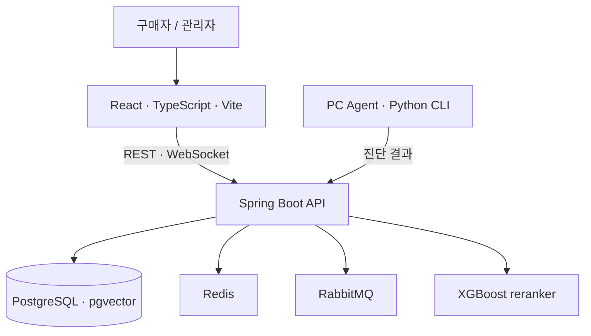
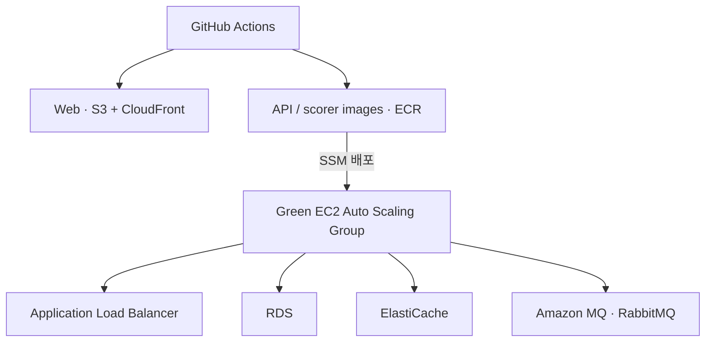

# BuildGraph AI architecture

이 문서는 저장소에서 확인되는 애플리케이션 구성과 PR로 추가된 Green 배포 경로를 요약합니다. 배포 다이어그램은 설정된 릴리스 경로를 설명하며, 현재 운영 트래픽이 해당 경로를 사용 중이라는 의미는 아닙니다.

## Application services

- 브라우저 UI는 REST API로 견적·상담 작업을 요청하고 상담 메시지의 실시간 수신에는 WebSocket을 사용합니다.
- Spring Boot API가 PostgreSQL/pgvector, Redis, RabbitMQ와 추천 scorer를 연동합니다.
- PC Agent는 Python CLI이며, 진단 결과와 AI 보조 흐름을 API에 연결합니다.

## Green deployment path

이 배포 단계는 EC2 Compose 배포에서 AWS 관리형 서비스 분리, Green 환경의 독립 릴리스, ASG 및 기존 인스턴스 빠른 배포·롤백 경로로 확장한 PR을 요약합니다.

- [PR #112](https://github.com/jungle-final-project/prototype/pull/112), [#113](https://github.com/jungle-final-project/prototype/pull/113): EC2 Compose·SSH 배포 경로
- [PR #160](https://github.com/jungle-final-project/prototype/pull/160): RDS, ElastiCache, Amazon MQ 연동 기반
- [PR #171](https://github.com/jungle-final-project/prototype/pull/171): Green 분리 배포와 이미지 SHA 기반 롤백
- [PR #193](https://github.com/jungle-final-project/prototype/pull/193), [#214](https://github.com/jungle-final-project/prototype/pull/214): API/Web ASG 및 릴리스 경로
- [PR #222](https://github.com/jungle-final-project/prototype/pull/222): 정상 인스턴스 대상 빠른 컨테이너 교체와 롤백
